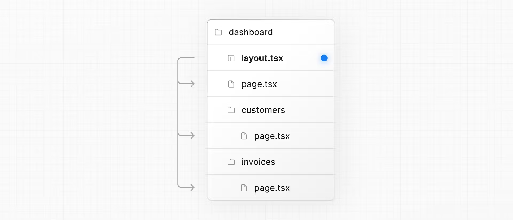
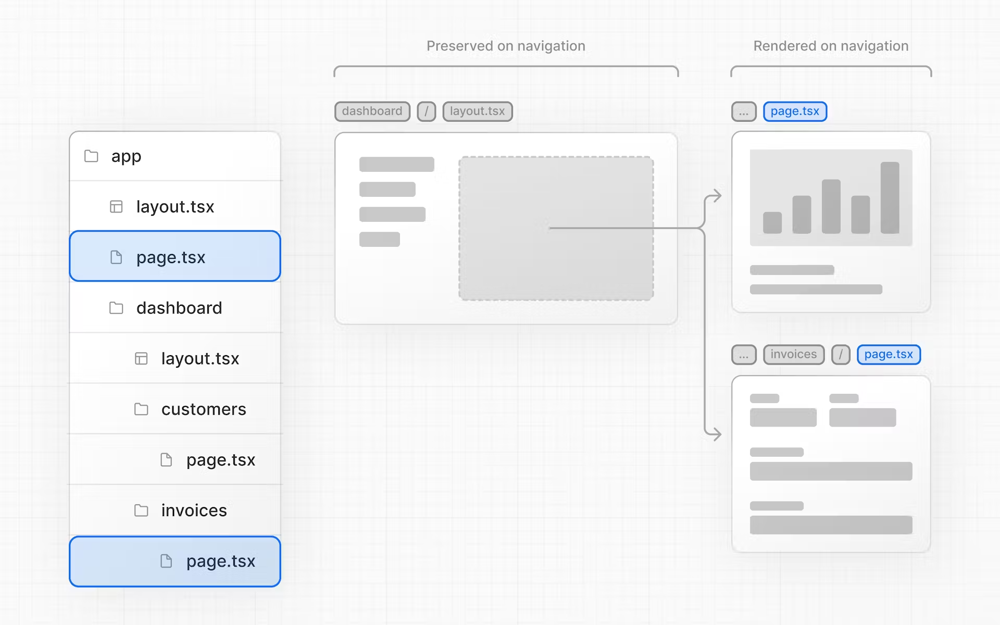

## Next.js App Router Course - Starter

This is the starter template for the Next.js App Router Course. It contains the starting code for the dashboard application.

For more information, see the [course curriculum](https://nextjs.org/learn) on the Next.js Website.

# Next.js markdown guide

from here i will try to make as many notes as possible and link the code specified in the training for an easy way to view the example in action. hopefully as i am building my own applications this guide will make it easier to find the solutions to common problems i may face in production

this is an example of a link that will take me to a file with a nonworking markdown referrence within the file: 
#### [line # w/ file link](./app/page.tsx)

## Directory

[images](#images)

[layouts and pages](#layoutsAndPages)

[Navigating Between Pages](#navigatingbetweenpages)

## images
The <Image> Component is an extension of the HTML  tag, and comes with automatic image optimization, such as: [#images](./app/page.tsx)

## LayoutsAndPages
next.js uses file-system routing where folders are used to create nested routes. each folder represents a route segment that maps to a URL segment for example. you see the dashboard folder, you can assume the URL path by looking at the folder path. so http://localhost:3000/dashboard will show you the contents outputted by page.tsx.

Dashboards have some sort of navigation that is shared across multiple pages. In Next.js, you can use a special layout.tsx file to create UI that is shared between multiple pages. Let's create a layout for the dashboard pages!
First, you're importing the 

    <SideNav /> 

component into your layout. Any components you import into this file will be part of the layout.
The <Layout /> component receives a children prop. This child can either be a page or another layout. In your case, the pages inside /dashboard will automatically be nested inside a <Layout /> like so:
[dashboard](../nextjs-dashboard/app/dashboard/layout.tsx)

the layout is now nested and will be incorporated into its children files

One benefit of using layouts in Next.js is that on navigation, only the page components update while the layout won't re-render. This is called partial rendering:

the purpose of the layout file is to share UI across multiple pages:w

## NavigatingBetweenPages